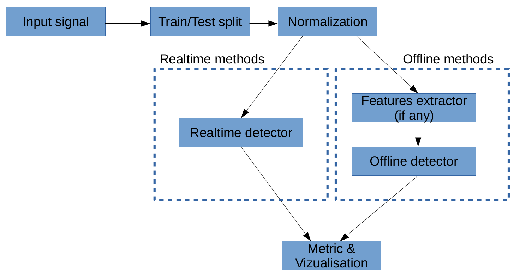
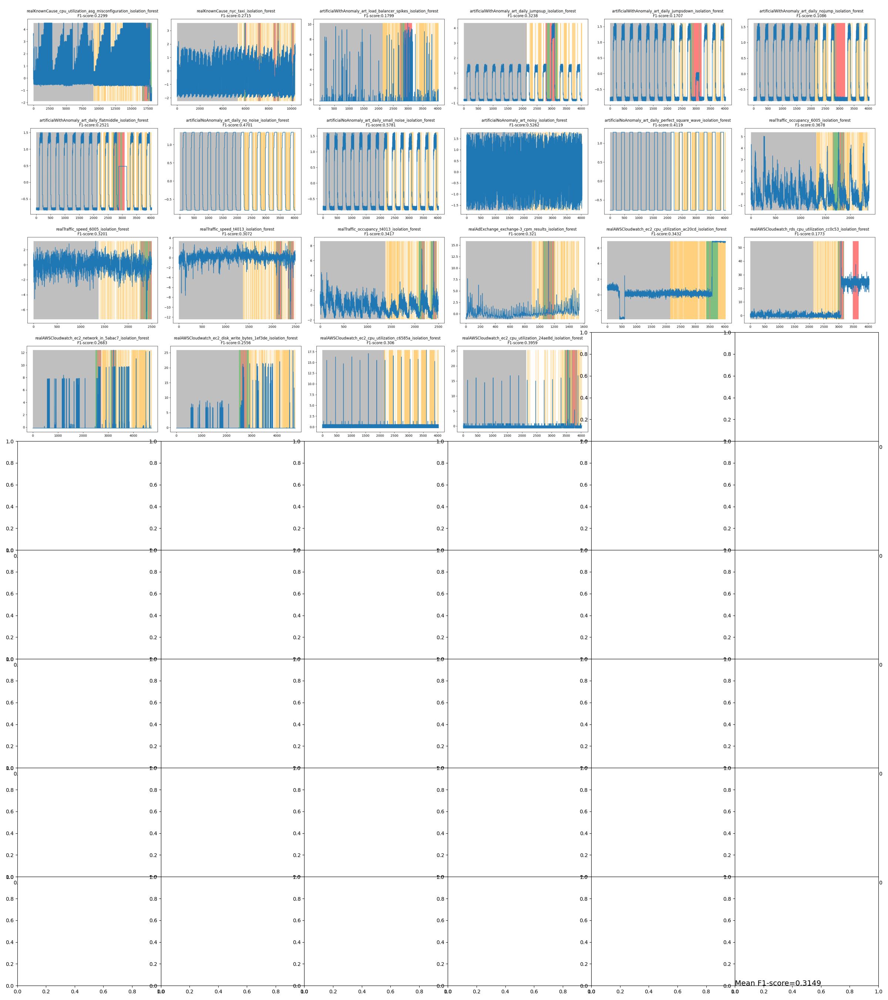

This repo aims to compare different recent anomaly detection methods.

Typical anomaly detection algorithms are calibrated on anomaly-free historical data samples and used on the remainder of the time series where we are looking for anomalies. Two main approaches are evaluated: real-time anomaly detection and offline anomaly detection. Only univariate anomaly detection with unsupervised learning is evaluated here.

# METHODS

**Offline time series anomaly detection** takes a fixed sequence of input data samples as input named a "frame", and returns if there is an anomaly in the frame. They are convenient methods to detect anomalies in stored files with maximum reliability.
The usual workflow runs the following steps (you can follow them in the lower figure):
1. The input signal is **split between training/testing**. The first samples serve to train/calibrate the detector, and the following serves to test its ability to ring anomalies when needed. For each time series here, I use a  15%/85% ratio of training/testing data samples.
3. The signal is **standardized**. Like it is commonly done, we compute mean &mu; and std &sigma; on the training (anomaly-free) signal. Then we standardize x_train=(x_train-&mu;)/(&sigma;) and x_test=(x_test-&mu;)/(&sigma;)
4. The input signal is **split into frames**. For example, the time series [5,6,2,7,8,9] with 3 length frames, would produce those 4 frames: [5,6,2], [6,2,7], [2,7,8], [7,8,9]. During this step, we may apply data augmentation or features extraction to improve the detector's ability to extract useful information and ignore the noise.
5. The detector is **trained** on the training split.
6. During the **inference phase**, the frame of values is given to the detector.

The Python code below shows a common piece of code to train and predict (5th and 6th steps above).
```python
hyperparameters={"n_estimator":128}
from sklearn.ensemble import IsolationForest
model=IsolationForest(hyperparameters)
model.fit(X_train_frames) # we can iterate on "fit" method to improve the model
anomaly_detection=model.predict(X_test_frames)
```

**Realtime time series anomaly detections** consist in predicting incoming one-by-one values. They are especially useful to detect early an error. However, they seem less accurate than offline methods.
```python
hyperparameters={"n_estimator":128}
from sklearn.ensemble import IsolationForest
# We don't need to iterate on the training phase. It is common to give training samples to the constructor.
model=IsolationForest(X_train, hyperparameters)
anomaly_detection=[]
for v in gen_X_test(): #generator producing 1-per-1 test value
	a=model.predict(v)
	anomaly_detection.append(a)
```


To compare multiple workflows at scale on many time series I design this workflow. It allows to loop easily or distributed the computing of the experiments. Each step needs to be called using their id-name and may require specific hyperparameters.



Methods used:
- Features extractor may include: data augmentation (keyword: "DATAAUG"), ROCKET [^1] ("ROCKET"), autoencoder compression ("AE"), or no one ("IDENTITY").
- Realtime detectors:  Adaptive Resonance [^2] ("ARTIME"), Conformal Anomaly Detector K-NN [^3] ("CADKNN"), x ("OSE"), Relative Entropy ("RE").
- Offline detectors: Autocoender with loss reconstruction ("AE"), IsolationForest [^4] ("IFOREST"), One-class SVM ("ONESVM"), EllipticEnvelope ("ELLIPTIC").


[^1]: "ROCKET: Exceptionally fast and accurate time series classification using random convolutional kernels", A. Dempster,  Data Mining and Knowledge Discovery 2020,  https://doi.org/10.1007/s10618-020-00701-z
[^2]: "Unsupervised real-time anomaly detection for streaming data", S. Ahmada et al., Neurocomputing 2017, https://doi.org/10.1016/j.neucom.2017.04.070 
[^3]: "Conformal k-NN Anomaly Detector for Univariate Data Streams", V. Ishimtsev et al., PMLR 2017, http://proceedings.mlr.press/v60/ishimtsev17a/ishimtsev17a.pdf
[^4]: "Isolation forest", ICDM 2008, F. T. Liu, https://doi.org/10.1109/ICDM.2008.17


Notice: autoencoders are used in two different ways and require different hyperparameters. For features extraction, we use 5 conv. layers, and the detector 9 conv. layers.

Frameworks used:
- tsaug [relevant doc page here](https://tsaug.readthedocs.io/en/stable/notebook/Examples%20of%20augmenters.html):  data augmentation for time series. It includes diverse kinds of noise: speed shift, gaussian multiplicative noise on each value,...
- pyts [relevant doc page here](https://pyts.readthedocs.io/en/stable/modules/transformation.html): data augmentation for time series. It includes recent methods such as ROCKET.
- scikit-learn [relevant doc page here](https://scikit-learn.org/stable/modules/outlier_detection.html): (non-deep) Machine Learning offline anomaly detectors: One-class SVM, Isolation Forest, Elliptic Envelope...
- numenta [github here](https://github.com/numenta/NAB): Realtime anomaly detection. It implements recent methods such as ARTime.
- tensorflow2.9 [relevant doc page here](https://keras.io/examples/timeseries/timeseries_anomaly_detection/): Autoencoder for detecting anomaly based on loss reconstruction, or Autoencoder for extract features.


# DATASETS
The time series are included in this github in ./data/NAB/. Official link is: https://github.com/numenta/NAB/tree/master/data

I tested my algorithms on NAB time series files. 58 files are present but 51 are valid for large-scale experiments. 7 files are invalid for one of those two reasons:
- The timeseries contains too early anomalies. So, we cannot easily calibrate the algorithms on anomaly-free signals.
- The timeseries contains NaN values.

Notice: A few files are fully anomaly-free (e.g., realAWSCloudwatch/ec2_cpu_utilization_c6585a.csv). The F1-score formula would fail due to arithmetic reason (division per zero) but we expect the detector produces no False Positive. I compute the accuracy on them and tag it as "F1 score" in the remaining.

The tested algorithms can be evaluated beyond those 51 files. Further possible investigations would include more time series: multi-variate time series, multi-modal time series, time series clustering, ...


# OFFLINE STRATEGY - EXPERIMENTAL RESULTS

Let's compare a simple strategy on all datasets. It consists to used the normed signal frame-per-frame to IsolationForest. The length of frames is 128 values, and 15% of the time series are used as unsupervised training ("unsupervised" but we know there is no anomaly in the training split).

```python
import os
from extract_data import extract_datasets
from offline_AD import OFFLINE_AD
from insight import plot_curves
datasets=extract_datasets("./data/NAB/")
paths=[] # we will build a beautiful mosaic
for dataset_name, dataset in datasets.items():
    try:
        stats=None
        stats,details=OFFLINE_AD(dataset,
                train_test_split_rate=0.15,
                frame_size=128,
                normalize_strategy_name="STD",
                FE_frame_strategy_name="IDENTITY",
                AD_strategies_name="IFOREST" #IsolationForest
            )
    except Exception as err:
        print(f"Exception with dataset {dataset_name} type:{type(err)} msg:{err}")
    if stats is not None:
        print(dataset_name, " stats:", stats)
```

It produces:
```
realKnownCause/rogue_agent_key_hold.csv  stats: {'tn': 422, 'fp': 861, 'fn': 0, 'tp': 190, 'f1': 0.3062}
realKnownCause/ec2_request_latency_system_failure.csv  stats: {'tn': 1578, 'fp': 1377, 'fn': 130, 'tp': 216, 'f1': 0.2228}
Exception with dataset realKnownCause/machine_temperature_system_failure.csv type:<class 'ValueError'> msg:The beginning of the time series should be anomaly-free
realKnownCause/machine_temperature_system_failure.csv  stats: {'tn': 1578, 'fp': 1377, 'fn': 130, 'tp': 216, 'f1': 0.2228}
realKnownCause/cpu_utilization_asg_misconfiguration.csv  stats: {'tn': 12347, 'fp': 1370, 'fn': 408, 'tp': 1091, 'f1': 0.551}
... ~50 lines are masked for visibility purpose
realAWSCloudwatch/ec2_cpu_utilization_24ae8d.csv  stats: {'tn': 2666, 'fp': 229, 'fn': 304, 'tp': 102, 'f1': 0.2768}
```

## Comparing different features extractors
The training and testing signals have been normed, I fix the dataset (art_daily_jumpsdown) and the anomaly detector step (Isolation Forest). An ideal methodology should compute the F1-score acress dozens of different datasets and different runtimes (random seeds) but would increase significantly the training time.
```python
from offline_AD import OFFLINE_AD
from extract_data import extract_one_dataset
dataset=extract_one_dataset("./data/NAB/", "artificialWithAnomaly/art_daily_jumpsdown.csv")
for feature_extractor in ["IDENTITY",
                          "AE",
                          "ROCKET",
                          "DATAAUG"]:
    stats,details=OFFLINE_AD(dataset,
            train_test_split_rate=0.15,
            frame_size=128,
            normalize_strategy_name="STD",
            FE_frame_strategy_name=feature_extractor,
            AD_strategies_name="IFOREST" #IsolationForest
        )
    print(feature_extractor," stats:", stats)
```
produces:
```
IDENTITY  stats: {'tn': 2866, 'fp': 30, 'fn': 310, 'tp': 95, 'f1': 0.3585}
AE  stats: {'tn': 2842, 'fp': 54, 'fn': 288, 'tp': 117, 'f1': 0.4062}
ROCKET  stats: {'tn': 2652, 'fp': 244, 'fn': 379, 'tp': 26, 'f1': 0.077}
DATAAUG  stats: {'tn': 2886, 'fp': 10, 'fn': 314, 'tp': 91, 'f1': 0.3597}
```

** Conclusion: AE is more accurate but at the cost of significant training time. DATAAUG produces hardly small improvement and require a lot of tuning: (choice of noise kinds, probability of the noise, amplitude of the noises...). Indeed, no feature extractor (identity) is a robust, simple and fast strategy.**

More investigations should sweep other technics available. Pyts framework propose easily testable recent features extractors.

## Compare different offline algorithms

Now we see AE is a better feature extractors, we will compare different detectors
```python
from offline_AD import OFFLINE_AD
from extract_data import extract_one_dataset
dataset=extract_one_dataset("./data/NAB/", "artificialWithAnomaly/art_daily_jumpsdown.csv")
#for detector in ["AE","ELLIPTIC","ONESVM","IFOREST", [IFOREST,AE]]:
for detector in ["AE","ELLIPTIC","ONESVM","IFOREST"]:
    stats,details=OFFLINE_AD(dataset,
                train_test_split_rate=0.15,
                frame_size=128,
                normalize_strategy_name="STD",
                FE_frame_strategy_name="AE",
                AD_strategies_name=detector #IsolationForest
            )
    print(detector, " stats:", stats)
```
produces
```
AE  stats: {'tn': 2864, 'fp': 32, 'fn': 232, 'tp': 173, 'f1': 0.5672}
ELLIPTIC  stats: {'tn': 2890, 'fp': 6, 'fn': 404, 'tp': 1, 'f1': 0.0049}
ONESVM  stats: {'tn': 1496, 'fp': 1400, 'fn': 187, 'tp': 218, 'f1': 0.2155}
IFOREST  stats: {'tn': 2834, 'fp': 62, 'fn': 290, 'tp': 115, 'f1': 0.3952}
```

AE as features extractor and AE as detectors means two autoencoders are cascading. This cascade is way better than 1 single AE+IsolationForest (f1: 0.4062) but it requires two AE and they are significantly slower than non-deep ML algorithms such as IsolationForest.


## LARGE-SCALE INSIGHT
I take the simple and fast strategy consisting in applying Isolation Forest on a standardized signal.
```python
import os
from extract_data import extract_datasets
from offline_AD import OFFLINE_AD
from insight import plot_curves, mosaic
datasets=extract_datasets("./data/NAB/")
paths=[] # we will build a beautiful mosaic
for dataset_name, dataset in datasets.items():
    try:
        stats=None
        stats,details=OFFLINE_AD(dataset,
                train_test_split_rate=0.15,
                frame_size=128,
                normalize_strategy_name="STD",
                FE_frame_strategy_name="IDENTITY",
                AD_strategies_name="IFOREST"
            )
    except Exception as err:
        print(f"Exception with dataset {dataset_name} type:{type(err)} msg:{err}")
    if stats is not None:
        # Monitor
        print(dataset_name, " stats:", stats)
        name = dataset_name.replace(os.sep, "_").split(".")[0] + "_isolation_forest"
        path = os.path.join("media", name + ".png")
        paths.append(path)
        txt = name + "\nF1-score:" + str(stats["f1"])
        plot_curves(x_train=details["train_dataset"]["x"],
                    x_test=details["test_dataset"]["x"],
                    y_test=details["test_dataset"]["y"],
                    y_pred=details["y_test_pred"],
                    frame_size=details["frame_size"],
                    path=path, txt=txt)
mosaic(paths,"mosaic.png")
```


Click on it for a better view: time series name, F1-score, and detection/ground truth.

Legend:
- grey: training split
- no color: True negative
- green: True positive
- red: False negative error
- orange: False positive error

**The margin for improvement is obvious. On the majority of time series it is better than random, on some others, the method performs equally to random (everything tagged as non-anomaly).**

# ONLINE STRATEGY - EXPERIMENTAL RESULTS
Let's evaluate 4 real-time anomaly detection strategies
```
from realtime_AD import REALTIME_AD
from extract_data import extract_one_dataset
dataset=extract_one_dataset("./data/NAB/", "artificialWithAnomaly/art_daily_jumpsdown.csv")
for detector in ["RE", "CADKNN", "ARTIME","OSE"]:
    stats=REALTIME_AD(dataset,
                train_test_split_rate=0.15,
                normalize_strategy_name="STD",
                AD_strategies_name=detector
            )
    print(detector, " stats:", stats)
```
produces:
```
RE  stats: {'tn': 3004, 'fp': 19, 'fn': 399, 'tp': 6, 'f1': 0.0279}
CADKNN  stats: {'tn': 1568, 'fp': 1455, 'fn': 198, 'tp': 207, 'f1': 0.2003}
ARTIME  stats: {'tn': 3010, 'fp': 13, 'fn': 403, 'tp': 2, 'f1': 0.0095}
OSE  stats: {'tn': 2943, 'fp': 80, 'fn': 378, 'tp': 27, 'f1': 0.1055}
```

**The real-time strategy is less accurate than offline ones. However, they do not require to repeat the training when new data samples are incoming.
ARTime strategy fails while the author published amazing results. I am investigating further.**
